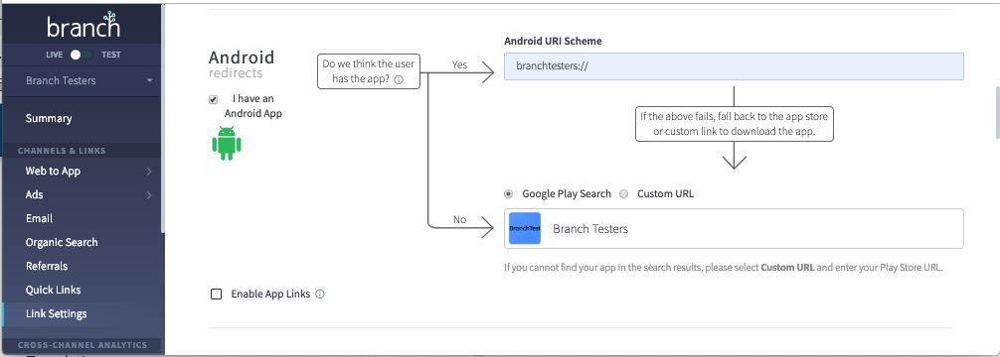

# 안드로이드 SDK 연동가이드

* 작성자 : 손보형
* 업데이트: 2019년 3월 15일
---
## 공식 연동 가이드
아래의 공식 가이드와 번역본도 함께 참고 하시기 바랍니다.

* [영문](https://docs.branch.io/apps/android/), [국문](https://bson-branch.github.io/docs/pages/apps/android/)

## 안드로이드 SDK 버전 히스토리
* [버전 히스토리](https://docs.branch.io/version-histories/android-version-history/)

## 안드로이드 SDK 정보
* 사이즈는 대략 200KB 입니다.
* 버전 3.0부터는 안드로이드 API LEVEL 16 (Android 4.1, 4.1.1 JELLY_BEAN) 이상을 지원하고 있습니다.
    * [Android API Level 정보](https://developer.android.com/guide/topics/manifest/uses-sdk-element#ApiLevels)
* 버전 3.0부터는 TLS1.2를 사용하여 통신하고 있습니다.


## 샘플 코드 관련 주의사항
* 이곳의 샘플코드는 [Branch Testers](https://play.google.com/store/apps/details?id=com.bson.branchtesters)에 사용된 코드이며 고객사의 이해를 돕기위해서 작성되었습니다.
* 고객사의 앱구현시에 참고용도로 사용하시고 각각의 앱에 맞게 수정하셔서 사용하시기 바랍니다.

## 브랜치 연동 가이드

* ### 링크 설정
    * 브랜치링크 클릭시 앱설치 유무에 따라 이후 동작에 필요한 정보들을 설정합니다.
    * [Link Setting : General](https://branch.dashboard.branch.io/link-settings/general) 페이지에서 설정합니다.
    * `I have an Android App`을 선택합니다.
    * `Do we think the user has the app`
        * `Yes` : `Android URI Scheme`에 앱의 스킴을 설정합니다.
        * `No` :
            * `Google Play Search` : 앱을 검색해서 설정합니다.
            * `Custom URL` : 앱 미설치시 랜딩시킬 URL과 안드로이드 패키지 네임을 설정합니다.

    


* ### 브랜치 라이브러리 임포트/설치

    - `build.gradle`내에 Branch SDK를 임포트 합니다.

        ```java hl_lines="30 31 32 33 34 36 37 38 39"
        apply plugin: 'com.android.application'

        android {
            compileSdkVersion 25
            buildToolsVersion "25.0.2"
            defaultConfig {
                applicationId "com.eneff.branch.example.android"
                minSdkVersion 16
                targetSdkVersion 25
                versionCode 1
                versionName "1.0"
                testInstrumentationRunner "android.support.test.runner.AndroidJUnitRunner"
            }
            buildTypes {
                release {
                    minifyEnabled false
                    proguardFiles getDefaultProguardFile('proguard-android.txt'), 'proguard-rules.pro'
                }
            }
        }

        dependencies {
            implementation fileTree(dir: 'libs', include: ['*.jar'])
            androidTestImplementation ('com.android.support.test.espresso:espresso-core:2.2.2', {
                exclude group: 'com.android.support', module: 'support-annotations'
            })
            implementation 'com.android.support:appcompat-v7:25.2.0'
            implementation 'com.android.support:design:25.2.0'

            // required
            implementation 'io.branch.sdk.android:library:3.+' // 브랜치 SDK입니다.
            // 앱실행시 아래의 에러가 발생하면 추가하세요.
            // ReferrerClientWrapper Exception: Failed resolution of: Lcom/android/installreferrer/api/InstallReferrerClient;
            implementation 'com.android.installreferrer:installreferrer:1.0'

            // optional
            implementation 'com.android.support:customtabs:23.3.0' // 크롬탭을 통한 매칭을 위해 필요합니다.
            implementation 'com.google.android.gms:play-services-ads:9+' // 구글 광고아이디를 수집하기위해 필요합니다.
            implementation 'com.google.android.gms:play-services-appindexing:9.+' // 안드로이드 App Links를 사용하시고 있는 경우 필요합니다.

            testImplementation 'junit:junit:4.12'
        }
        ```

* ### AndroidManifest.xml 설정
    * Application클래스의 onCreate()메쏘드 내에서 SDK가 초기화 되어야 하므로 application태그에 해당 Application 클래스를 지정하셔야 합니다.
    * 대쉬보드에서 라이브키와 테스트키 가져온뒤 이를 설정해야 합니다.
    * 테스트모드는 AndroidManifest.xml에서 설정하실 수도 있고 코드상으로 설정하실수도 있습니다.

        ```xml hl_lines="9 17 26 27 28 29 30 31 32 34 35 36 37 38 39 40 44 45 46 47 49 50 51 52 53 54"
        <?xml version="1.0" encoding="utf-8"?>
        <manifest xmlns:android="http://schemas.android.com/apk/res/android"
            package="com.eneff.branch.example.android">

            <uses-permission android:name="android.permission.INTERNET" />

            <application
                android:allowBackup="true"
                android:name="com.eneff.branch.example.android.CustomApplicationClass"
                android:icon="@mipmap/ic_launcher"
                android:label="@string/app_name"
                android:supportsRtl="true"
                android:theme="@style/AppTheme">

                <!-- Launcher Activity to handle incoming Branch intents -->    
                <activity
                    android:name=".LauncherActivity"
                    android:launchMode="singleTask"
                    android:label="@string/app_name"
                    android:theme="@style/AppTheme.NoActionBar">

                    <intent-filter>
                        <action android:name="android.intent.action.MAIN" />
                        <category android:name="android.intent.category.LAUNCHER" />
                    </intent-filter>

                    <!-- Branch URI Scheme -->
                    <intent-filter>
                        <data android:scheme="androidexample" />
                        <action android:name="android.intent.action.VIEW" />
                        <category android:name="android.intent.category.DEFAULT" />
                        <category android:name="android.intent.category.BROWSABLE" />
                    </intent-filter>

                    <!-- Branch App Links (optional) -->
                    <intent-filter android:autoVerify="true">
                        <action android:name="android.intent.action.VIEW" />
                        <category android:name="android.intent.category.DEFAULT" />
                        <category android:name="android.intent.category.BROWSABLE" />
                        <data android:scheme="https" android:host="example.app.link" />
                        <data android:scheme="https" android:host="example-alternate.app.link" />
                    </intent-filter>
                </activity>

                <!-- Branch init -->
                <meta-data android:name="io.branch.sdk.BranchKey" android:value="key_live_kaFuWw8WvY7yn1d9yYiP8gokwqjV0Sw" />
                <meta-data android:name="io.branch.sdk.BranchKey.test" android:value="key_test_hlxrWC5Zx16DkYmWu4AHiimdqugRYMr" />
                <meta-data android:name="io.branch.sdk.TestMode" android:value="false" /> <!-- Set to true to use Branch_Test_Key -->

                <!-- Branch install referrer tracking (optional) -->
                <receiver android:name="io.branch.referral.InstallListener" android:exported="true">
                    <intent-filter>
                        <action android:name="com.android.vending.INSTALL_REFERRER" />
                    </intent-filter>
                </receiver>

            </application>

        </manifest>
        ```

    - 아래의 값들을 Branch 대쉬보드의 [App settings](https://dashboard.branch.io/account-settings/app)와 [Link settings](https://dashboard.branch.io/link-settings)의 설정값들로 변경합니다
        - `androidexample` :
            - URI 스킴으로 딥링킹을 할때 사용되는 스킴입니다.
            - [`CHANNELS & LINKS - Link settings`](https://dashboard.branch.io/link-settings)의 `Android redirects` 섹션의 `Android URI Scheme`에 설정된 앱의 URI 스키마를 설정합니다. (`://` 부분은 제외합니다.)
        - `example.app.link`, `example-alternate.app.link` :
            - **[안드로이드 App Links](https://developer.android.com/training/app-links)를 사용하시는 경우에 한해** [`CHANNELS & LINKS - Link settings`](https://dashboard.branch.io/link-settings) 페이지 최하단 `Link Domain` 섹션의 `Default Link Domain`과 `Alternate Link Domain`에 설정된 값으로 설정합니다.
            - 선택적으로 추가하는 부분으로 `안드로이드 App Links`를 사용하지 않으시는 경우 해당 `<intent-filter>` 태그 섹션을 추가하실 필요는 없습니다.
            - 앱에 할당되는 도메인에 관련해서는 [온보딩 가이드](https://bson-branch.github.io/docs/guides/branch/onboarding/#branch-link)를 참고하세요.
        - `key_live_kaFuWw8WvY7yn1d9yYiP8gokwqjV0Sw`, `key_test_hlxrWC5Zx16DkYmWu4AHiimdqugRYMr`:
            - 대쉬보드 좌측 [`SETUP & TESTING - Account Settings`](https://dashboard.branch.io/account-settings/app)페이지의 `PROFILE`탭의 `Branch Key and Secret`섹션내의  `Branch Key`의 값을 설정합니다.
            - 대쉬보드 좌측 상단 브랜치로고 바로아래의 `LIVE`와 `TEST` 토글 버튼을 사용해서 라이브모드의 브랜치키와 테스트모드의 브랜치키를 각각 확인할 수 있습니다.
            - **참고로, `Branch Key`와 `Branch Secret`는 외부에 유출이 되지 않도록 조심해 주시기 바랍니다.**

    !!! warning "Single Task launch mode설정이 필요합니다"
        안드로이드 시스템상에 SingleTask Activity 인스턴스가 없는 경우, 새로운 Activity가 생성되어 동일 Task의 스택의 최상위에 위치하게 됩니다.
        Single Task 모드로 설정할 경우 앱 전체가 재시작되지 않을 것입니다. Single Task모드에서는 Main/Splash Activity가 Activity Stack내에 존재하지 않을때만 Main/Splash Activity를 인스턴트를 생성하게됩니다. Main/Splash Activity가 백그라운드에 존재하는 경우에는 Intent가 전달되면 Activity를 포그라운드로 전환시키게 됩니다. Single Task 모드에 대한 자세한 내용은 [이곳](https://developer.android.com/guide/components/activities/tasks-and-back-stack.html#TaskLaunchModes)를 참조하시기 바랍니다.

* ### 브랜치 SDK 초기화

    * `CustomApplicationClass.java`에 Branch를 추가합니다.
    * `AndroidManifest.xml` 파일에서 Application클래스를 지정해주지 않으면 `onCreate()` 메쏘드는 호출되지 않음에 유의하세요.

    * *Java*
            ```java hl_lines="4 11 12 13 15 16 17 18 20 21 22"
            package com.eneff.branch.example.android;

            import android.app.Application;
            import io.branch.referral.Branch;

            public class CustomApplicationClass extends Application {
                @Override
                public void onCreate() {
                    super.onCreate();

                    // Disable Android ID collection.
                    // 구글에서는 구글 광고아이디 수집을 권장하고 있으므로 Android ID 수집기능을 비활성화 합니다.
                    Branch.disableDeviceIDFetch(true);

                    // Branch logging for debugging
                    // 디버깅목적으로 SDK 내부의 로그를 확인할 필요가 있을 때만 선택적으로 활성화 합니다.
                    // 릴리즈 빌드에서는 꼭 비활성화 하시기 바랍니다.
                    //Branch.enableLogging()는 deprecated 되었습니다.
                    Branch.enableDebugMode();

                    // Branch object initialization
                    // 브랜치 객체를 초기화 합니다.
                    Branch.getAutoInstance(this);
                }
            }
            ```

      * *Kotlin*

            ```java hl_lines="4 10 11 13 14"
            package com.eneff.branch.example.android

            import android.app.Application
            import io.branch.referral.Branch

            class CustomApplicationClass : Application() {
                override fun onCreate() {
                    super.onCreate()

                    // Branch logging for debugging
                    Branch.enableLogging()

                    // Branch object initialization
                    Branch.getAutoInstance(this)
                }
            }
            ```

* ### 세션 초기화

    * `LauncherActivity.java`에 Branch를 추가합니다.
    * `AndroidManifest.xml`에서 `launchMode`를 `singleTask`로 설정해 주시기 바랍니다.
    * `onStart()`메쏘드에서 `initSession()`을 호출하고 `BranchReferralInitListener`를 통해서 응답을 수신합니다.
    * `onInitFinished()` 메쏘드를 JSONObject로 전달되는 응답을 수신합니다.

    - *Java*

        ```java hl_lines="3 9 14 16 17 31 32 33 34 35 36 37 38 39 40 41 44 45 46 47"
        package com.eneff.branch.example.android;

        import android.content.Intent;
        import android.os.Bundle;
        import android.support.design.widget.FloatingActionButton;
        import android.support.design.widget.Snackbar;
        import android.support.v7.app.AppCompatActivity;
        import android.support.v7.widget.Toolbar;
        import android.util.Log;
        import android.view.View;
        import android.view.Menu;
        import android.view.MenuItem;

        import org.json.JSONObject;

        import io.branch.referral.Branch;
        import io.branch.referral.BranchError;

        public class LauncherActivity extends AppCompatActivity {

            @Override
            protected void onCreate(Bundle savedInstanceState) {
                super.onCreate(savedInstanceState);
                setContentView(R.layout.activity_launcher);
            }

            @Override
            public void onStart() {
                super.onStart();

                // Branch init
                Branch.getInstance().initSession(new Branch.BranchReferralInitListener() {
                    @Override
                    public void onInitFinished(JSONObject referringParams, BranchError error) {
                        if (error == null) {
                            Log.i("BRANCH SDK", referringParams.toString());
                            // Retrieve deeplink keys from 'referringParams' and evaluate the values to determine where to route the user
                            // Check '+clicked_branch_link' before deciding whether to use your Branch routing logic
                        } else {
                            Log.i("BRANCH SDK", error.getMessage());
                        }
                    }
                }, this.getIntent().getData(), this);
            }

            @Override
            public void onNewIntent(Intent intent) {
                this.setIntent(intent);
            }
        }
        ```

    - *Kotlin*

        ```java hl_lines="3 9 14 16 17 29 30 31 32 33 34 35 36 37 38 41 42 43"
        package com.eneff.branch.example.android

        import android.content.Intent
        import android.os.Bundle
        import android.support.design.widget.FloatingActionButton
        import android.support.design.widget.Snackbar
        import android.support.v7.app.AppCompatActivity
        import android.support.v7.widget.Toolbar
        import android.util.Log
        import android.view.View
        import android.view.Menu
        import android.view.MenuItem

        import org.json.JSONObject

        import io.branch.referral.Branch
        import io.branch.referral.BranchError

        class LauncherActivity : AppCompatActivity() {

            override fun onCreate(savedInstanceState: Bundle?) {
                super.onCreate(savedInstanceState)
                setContentView(R.layout.activity_launcher)
            }

            override fun onStart() {
                super.onStart()

                // Branch init
                Branch.getInstance().initSession(object : BranchReferralInitListener {
                    override fun onInitFinished(referringParams: JSONObject, error: BranchError?) {
                        if (error == null) {
                            Log.e("BRANCH SDK", referringParams.toString)
                            // Retrieve deeplink keys from 'referringParams' and evaluate the values to determine where to route the user
                            // Check '+clicked_branch_link' before deciding whether to use your Branch routing logic
                        } else {
                            Log.e("BRANCH SDK", error.message)
                        }
                    }
                }, this.intent.data, this)
            }

            public override fun onNewIntent(intent: Intent) {
                this.intent = intent
            }
        }
        ```

    !!! warning "Branch SDK는 꼭 Launcher Activity에서 초기화 되어야 합니다."
        앱은 Launcher Activity를 통해서 열릴것이고, 이 Activity에서 Branch SDK가 초기화 되고 클릭했던 링크의 데이터가 리턴됩니다.

    !!! warning "`onStart()`에서만 Branch SDK를 초기화 되어야 합니다."
        Branch SDK를 `onResume()`와 같은 다른 라이프사이클 메쏘드내에서 초기화 하면 의도되지 않은 문제가 발생할 수 있습니다. `onStart()`는 Activity를 사용자에게 보여지는 단계이며 앱이 포그라운드로 전환되어 사용자와의 상호작용을 하기 위한 준비를 하는 곳입니다. 좀더 자세한 사항은 [이곳](https://developer.android.com/guide/components/activities/activity-lifecycle.html)을 참고하시기 바랍니다.


* ###  브랜치 레퍼럴 처리
    * `Branch.BranchReferralInitListener.onInitFinished()` 메쏘드를 통해서 수신되는 BranchReferral과 처리방법 대해 좀더 자세히 설명합니다.

    * 브랜치 레퍼럴 파라메터 프리픽스
        * **~** : Analytics 용도의 파라메터 입니다.
        * **+** : Branch서비스에서 추가한 정보 파라메터입니다.
        * **$** : Branch서비스의 예약된 키워드들 입니다.

    * 브랜치 레퍼럴 파라메터
        * **+clicked_branch_link** : 앱실행 이전에 브랜치 링크 클릭이 있었는지 여부. (매칭된 클릭이 있는지 여부)
        * **+is_first_session** : 인스톨 이후 최초 실행인지 여부
        * **+match_guaranteed** : 매칭된 클릭이 정확한지 여부, 핑거프린팅에 의한 것일 때는 false가 리턴됨. 정확한 매칭이 아닐경우 딥링킹여부는 고객사에서 적절히 판단하시면됩니다.
        * **+referrer** : 링크를 클릭한 웹페이지 주소
        * **+click_timestamp** : 링크를 클릭한 시각 (초단위 EPOCH타임)

        * **$marketing_title** : Quick Link생성시 설정한 링크 이름
        * **$link_title** : Universal Link 생성시 설정한 링크 이름
        * **$one_time_use** : 1회성 으로 생성된 링크인지 여부
        * **$deeplink_path** : Branch Link 생성시에 설정된 딥링크 패스.
            * 일반적으로 Branch도입 이전의 딥링킹 기능에 호환되게 사용하려 할때 사용합니다.
        * **$3p** :
            * **Universal Ads**: `a_`로 시작되는 광고매체에 부여되는 이름. 예) a_awesome_ad_partner
            * **Universal Email**: `e_`로 시작되는 이메일 연동매체에 부여되는 이름. 예) e_awesome_email_partner


        * **~marketing** :
        * **~advertising_partner_name** : Universal Ads의 광고매체의 이름. 예) "Awesome Ad Parnter".
        * **~branch_ad_format** : 브랜치 광고포멧.
        * **~channel** : 링크 생성시 지정된 채널정보 입니다.
        * **~feature** : 링크 생성시 설정된 해당 브랜치링크의 기능을 알려주는 파라메터입니다.
            * **Quick Link** : `marketing`
            * **Universal Ads** : `paid advertising`
        * **~campaign** : 링크 생성시 설정된 캠페인정보입니다.
        * **~tags** : 링크 생성시 설정된 태그들입니다.
        * **~stage** : 링크 생성시 설정된 stage정보입니다.
        * **~creation_source** : 링크가 생성된 곳을 알려줍니다.
            * `0`: API
, `1`: Quick Link, `2`: SDK, `3`: iOS SDK
, `4`: Android SDK
, `5`: Web SDK, `6`: Dynamic, `7`: Third party
        * **~referring_link** : 클릭한 브랜치 링크 URL
        * **~id** : 클릭 아이디
        * **~campaign_id** :
        * **~click_id** :

* ###  상황별 전달되는 브랜치 레퍼럴 예
    * (클릭없이) 설치후 **최초** 오픈시
    ```json
    {
      "+clicked_branch_link":false,
      "+is_first_session":true
    }
    ```

    * (클릭없이 단순) 앱 오픈시
    ```json
    {
      "+clicked_branch_link":false,
      "+is_first_session":false
    }
    ```

    * 퀵링크 클릭후 오픈시 (마켓 랜딩)
        * 리턴되는 브랜치 레퍼러 파라메터 JSON
        ```json
        {
          "+match_guaranteed":true,
          "$marketing_title":"Mar12",
          "~creation_source":1,
          "~marketing":true,
          "+clicked_branch_link":true,
          "+referrer":"https:\/\/test.test.com\/b\/",
          "+click_timestamp":1552370726,
          "$one_time_use":false,
          "~id":"633881367411184970",
          "+is_first_session":false,
          "~referring_link":"https:\/\/branchtesters.app.link\/4Pz0A6wlZU",
          "~feature":"marketing"
        }
        ```
        * 이미 앱이 설치되어 있는경우 Intent의 Data로 전달되는 딥링크
            * 딥링크를 설정하지 않은 경우 쿼리파라메터에 `open?link_click_id=123456789`가 추가되어 앱을 실행시킵니다.
            * 예) 샘플앱 Branch Testers
            ```
            branchtesters://open?link_click_id=633895650092880072
            ```

    * 퀵링크 클릭후 오픈시 (마켓 랜딩 & 딥링크)
        * 설정한 딥링크 : `test`
        * 리턴되는 브랜치 레퍼러 파라메터 JSON
        ```json
        {
            "$marketing_title":"Mar12 : branchtesters:\/\/test",
            "$deeplink_path":"test",
            "~creation_source":1,
            "+referrer":"https:\/\/test.test.com\/b\/",
            "+click_timestamp":1552373501,
            "~feature":"marketing",
            "+match_guaranteed":true,
            "~marketing":true,
            "+clicked_branch_link":true,
            "$one_time_use":false,
            "~id":"633881685448153127",
            "+is_first_session":false,
            "~referring_link":"https:\/\/branchtesters.app.link\/JGhpKHClZU"
        }
        ```
        * 이미 앱이 설치되어 있는 경우 Intent의 Data로 전달되는 딥링크
            * 딥링크를 설정하지 않은 경우 쿼리파라메터에 `link_click_id` 가 추가되어 앱을 실행시킵니다.
            * 예) 샘플앱 Branch Testers
            ```
            branchtesters://test?link_click_id=633895650092880072
            ```

    * Universal Ads용 링크 클릭후 오픈시 (마켓 랜딩 & 딥링크)
        * 설정한 딥링크 : `test`
        * 리턴되는 브랜치 레퍼러 파라메터 JSON
        ```json
        {  
           "$3p":"a_awesome_ad_partner",
           "~advertising_partner_name":"Awesome Ad Parnter",
           "$deeplink_path":"random&src=wp",
           "+referrer":"https:\/\/test.test.com\/b\/",
           "+click_timestamp":1551862954,
           "~feature":"paid advertising",
           "+match_guaranteed":false,
           "$link_title":"mar6_wp",
           "+clicked_branch_link":true,
           "$one_time_use":false,
           "~id":"631754293485575032",
           "~branch_ad_format":"App Only",
           "+is_first_session":false,
           "~referring_link":"https:\/\/r5xx.app.link\/spLebMwBPU?%243p=a_awesome_ad_partner",
           "~channel":"Awesome Ad Parnter",
        }

        ```
        * 이미 앱이 설치되어 있는 경우 Intent의 Data로 전달되는 딥링크
            * 딥링크를 설정하지 않은 경우 쿼리파라메터에 `link_click_id` 가 추가되어 앱을 실행시킵니다.
            * 예) 샘플앱 Branch Testers
            ```
            branchtesters://test?link_click_id=633895650092880072
            ```


* ###  브랜치 레퍼럴 처리 샘플 코드
    * Activity.onStart()의 구현 샘플입니다.
    * 브랜치링크 생성시 **$deeplink_path**에 실제 설정한 딥링크를 사용한 딥링크 처리코드입니다.
       이 방식은 기존의 URI 스킴방식의 딥링크 처리로직을 그대로 유지하시면서 Branch의 딥링킹을 사용하시고 경우에 활용하실 수 있습니다.

    ```java
    @Override
    public void onStart() {
        super.onStart();

        String deeplink = null;

        // 인텐트에서 딥링크를 추출합니다.
        Intent intent = getIntent();
        if (intent != null && intent.getData() != null) {
            // 앱이 딥링킹 되었을 경우, deeplink에 딥링크를 설정합니다.
            deeplink = intent.getData().toString();
        }

        // Branch의 세션을 초기화 하고 딥링크를 조회 합니다.
        Branch branch = Branch.getInstance();
        if (branch != null) {
            if (deeplink != null) {
                // 샘플앱의 경우에는 딥링킹 되었다면 Branch 세션은 초기화 하지만 수신한 딥링크를 처리하지 않습니다.
                // 앱별로 다르게 처리하셔도 무방하며, 매칭된 클릭이 있는지 확인할 필요가 있는 경우에는 단순오픈 때와 같이 처리할 수도 있습니다.
                branch.initSession(new Branch.BranchReferralInitListener() {
                    @Override
                    public void onInitFinished(JSONObject referringParams, BranchError error) {
                        if (error == null && referringParams != null) {
                            // 에러없이 응답을 수신한 경우.
                        } else {
                            // 에러가 발생했거나 널 응답을 수신한 경우.
                        }
                    }
                }, this.getIntent().getData(), this);
                // 딥링크를 처리하는 함수를 호출합니다.
                handleDeeplink(deeplink, null);
            } else {
                // 앱이 단순 오픈 되었다면 세션을 초기화 하고 리턴된 딥링크를 조회합니다.
                branch.initSession(new Branch.BranchReferralInitListener() {
                    @Override
                    public void onInitFinished(JSONObject referringParams, BranchError error) {
                        Util.log("onInitFinished() START");
                        if (error == null && referringParams != null) {
                            // 에러없이 응답을 수신한 경우.
                            try {
                                // 앱이 최초로 오픈 되었는지 여부입니다. 필요시에는 이 값을 사용하실 수 있습니다.
                                boolean isFirstSession = false;
                                if (referringParams.has("+is_first_session")) {
                                    isFirstSession = (boolean) referringParams.get("+is_first_session");
                                    // 필요한 경우 어떤 작업을 수행할 수 있습니다.
                                }
                                if ( referringParams.has("+clicked_branch_link") &&
                                        referringParams.has("+match_guaranteed") &&
                                        referringParams.has("$deeplink_path")
                                        /*referringParams.has("+click_timestamp")*/ ) {
                                    boolean plusClickedBranchLink = (boolean) referringParams.get("+clicked_branch_link");
                                    boolean plusMatchGuaranteed = (boolean) referringParams.get("+match_guaranteed");
                                    String dollorDeeplinkPath = (String) referringParams.get("$deeplink_path");

                                    boolean DEEP_LINK_ONLY_FOR_STRONG_MATCHING = true;
                                    String DEEP_LINK_SCHEME = "branchtesters://";
                                    if (plusClickedBranchLink) {
                                        // 클릭이 매칭된 경우
                                        if (DEEP_LINK_ONLY_FOR_STRONG_MATCHING && plusClickedBranchLink == true) {
                                            // 이 샘플앱에서는 정확한 매칭일 경우만 딥링킹을 수행하도록 하였습니다.
                                            // 앱별 필요에 따라서 추측성 매칭의 경우에도 딥링킹을 수행하실수도 있습니다.
                                            // 딥링크 처리 메쏘드에서 처리합니다.
                                            // 딥링크의 Path 이하만 리턴되기 때문에 앞부분을 추가하셔서 딥링크를 만드셔야 합니다.
                                            handleDeeplink(DEEP_LINK_SCHEME + dollorDeeplinkPath, referringParams);
                                        } else {
                                            // 이 샘플앱은 추측성 매칭의 경우에는 딥링킹을 수행하지 않습니다.
                                        }
                                    } else {
                                        // 매칭된 클릭이 없는 경우
                                        if (referringParams.has("+non_branch_link")) {
                                            String nonBranchLink = (String) referringParams.get("+non_branch_link");
                                        } else {
                                            // 단순 오픈
                                        }
                                    }
                                }
                            } catch (JSONException je) {
                                Util.log("###### " + je.toString());
                            } catch (Exception e) {
                                Util.log("###### " + e.toString());
                            }
                        } else {
                            // 에러가 발생했거나 널 응답을 수신한 경우.
                            Util.log("###### " + error.getMessage());
                        }
                    }
                }, this.getIntent().getData(), this);
            }
        }
    }

    ```

* ###  딥링크 처리 샘플 코드
    * 위의 샘플의 호출한 `handleDeeplink()`메쏘드의 샘플입니다.
    * 기존 딥링크 처리 부분에 브랜치레퍼럴 수신시에는 필요한 경우 해당 정보를 활용한 추가 기능을 사용하실 수 있습니다.

    ```java
    public void handleDeeplink(String deeplink, JSONObject params) {
        if (params != null) {
            // 브랜치 레퍼럴을 통해서 수신한 정보를 활용하실 수 있습니다.
            try {
                /*(
                String tilde_feature = (String) params.get("~feature");
                if (tilde_feature.equals("marketing")) {
                    // Quick Link
                } else if (tilde_feature.equals("paid advertising")) {
                    // Universal Ads
                    String dollor_3p = (String) params.get("$3p");
                    String tilde_advertising_partner_name = (String) params.get("~advertising_partner_name");
                }
                */
            } catch (Exception e) {
                Util.log("###### " + e.toString());
            }
        }

        if (deeplink != null) {
            ////////////////////////////
            // DO DEEPLINKING !!!
            // 앱이 직접 딥링킹 되는 경우와 Branch를 통해서 딥링킹이 되는 경우
            // 모두 동일하게 처리하실 수 있습니다.
        }

    }

    ```

- ### 수신된 브랜치 레퍼러 처리 샘플들.

    - 아래와 같이 다양한 방식을 활용하실 수 있습니다.

    - *Java*

        ```java
        // listener (within Main Activity's onStart)
        Branch.getInstance().initSession(new Branch.BranchReferralInitListener() {
            @Override
            public void onInitFinished(JSONObject referringParams, BranchError error) {
                if (error == null) {
                    // option 1: log data
                    Log.i("BRANCH SDK", referringParams.toString());

                    // option 2: save data to be used later
                    SharedPreferences preferences = .getSharedPreferences("MyPreferences", Context.MODE_PRIVATE);
                    SharedPreferences.Editor editor = preferences.edit();
                    editor.putString("branchData", referringParams.toString(2));
                    editor.commit();

                    // option 3: navigate to page
                    Intent intent = new Intent(MainActivity.this, OtherActivity.class);
                    intent.putExtra("branchData", referringParams.toString(2));
                    startActivity(intent);

                    // option 4: display data
                    Toast.makeText(this, referringParams.toString(2), Toast.LENGTH_LONG).show();
                } else {
                    Log.i("BRANCH SDK", error.getMessage());
                }
            }
        }, this.getIntent().getData(), this);
        ```

    - *Kotlin*

        ```java
        // listener (within Main Activity's onStart)
        Branch.getInstance().initSession(object : BranchReferralInitListener {
            override fun onInitFinished(referringParams: JSONObject, error: BranchError?) {
                if (error == null) {
                    // option 1: log data
                    Log.i("BRANCH SDK", referringParams.toString())

                    // option 2: save data to be used later
                    val preferences =  getSharedPreferences("MyPreferences", Context.MODE_PRIVATE)
                    val editor = preferences.edit()
                    editor.putString("branchData", referringParams.toString(2))
                    editor.commit()

                    // option 3: navigate to page
                    val intent = Intent(this, MainActivity2::class.java)
                    intent.putExtra("branchData", referringParams.toString(2))
                    startActivity(intent)

                    // option 4: display data
                    Toast.makeText(this, referringParams.toString(2), Toast.LENGTH_SHORT).show()
                } else {
                    Log.e("BRANCH SDK", error.message)
                }
            }
        }, this.intent.data, this)
        ```

- ### 컨텐츠 트래킹

    - 사용자의 컨텐츠를 조회를 트래킹합니다.

    - [Branch Universal Object](#컨텐츠-레퍼런스-생성)가 필요합니다.

    - [Track content properties](#track-content-properties)를 사용합니다.

    - [Branch Dashboard](https://dashboard.branch.io/liveview/content)에서 데이터를 검증합니다.

    - *Java*

        ```java
        new BranchEvent(BRANCH_STANDARD_EVENT.VIEW_ITEM).addContentItems(buo).logEvent(context);
        ```

    - *Kotlin*

        ```java
        BranchEvent(BRANCH_STANDARD_EVENT.VIEW_ITEM).addContentItems(buo).logEvent(context)
        ```

- ### 사용자 트래킹

    - 이벤트, 딥링크, Referral에 사용자에 대한 식별자(email, ID, UUID, etc)를 설정합니다. 사용자의 식별자 설정의 경우 꼭 사내 개인정보보호 관련부서와 사전 논의합니다.

    - 설정가능한 사용자 식별자의 최대 길이는 `127`입니다.

    - [Branch Dashboard](https://dashboard.branch.io/liveview/identities)에서 데이터를 검증합니다.

    - *Java*

        ```java
        // login
        Branch.getInstance().setIdentity("your_user_id");

        // logout
        Branch.getInstance().logout();
        ```

    - *Kotlin*

        ```java
        // login
        Branch.getInstance().setIdentity("your_user_id")

        // logout
        Branch.getInstance().logout()
        ```

- ### 이벤트 트래킹

    - 고객의 구매활동과 관련된 모든 이벤트들은 "Commerce" 클래스의 데이터아이템으로 분류됩니다.

    - 사용자가 앱내 컨텐츠와 상호작용하는 것에 관련된 모든 이벤트들은 "Content" 클래스의 데이터아이템으로 분류됩니다.

    - 사용자들이 앱사용을 진행하면서 발생하는 것에 관련된 모든 이벤트들은 "lifecycle" 클래스의 데이터아이템으로 분류됩니다.

    - 아래의 표에 없는 커스텀 이벤트에 대한 트래킹은 [Track Custom Events](https://docs.branch.io/pages/apps/v2event/#track-custom-events)문서를 참고하세요.

    - [Branch Dashboard](https://dashboard.branch.io/liveview/events)에서 데이터를 검증합니다.


    {! ingredients/sdk/v2-events.md !}


- ### 사용자 트래킹 활성화 / 비활성화

    GDPR관련 또는 다른 목적으로 트래킹을 원치 않는 사용자의 요청에 대응할 필요가 있다면, 네트워크 데이터전송을 차단하여 해당 사용자에 대한 트래킹을 중단할 수 있습니다. 이 기능은 특정링크 또는 브랜치 링크를 통해서 어떤 사용자에게든 활성화 할 수 있습니다.

    ```java
    Branch.getInstance().disableTracking(true);
    ```

    앱이 실행되는 동안 호출이 가능하며, 한번 호출이 되면 브랜치 SDK의 모든 네트워크 데이터 전송이 차단됩니다. 링크생성 기능은 계속 동작합니다만, 해당 유저를 식별할 수 있는 정보는 포함되지 않을 것입니다. 딥링킹도 계속 동작하지만 해당 유저에 대한 분석정보는 트래킹되지 않을 것입니다.


## 문제 해결

- ### 로깅기능 활성화
    - 3.1.0에서 enableLogging()에서 enableDebugMode()로 메쏘드 이름변경

    - *Java*

        ```java
        Branch.enableDebugMode();
        ```

- ### 브랜치 연동 테스트

    메인 Activity의 onStart()메쏘드 내에서 `IntegrationValidator.validate`메쏘드를 호출해서 브랜치연동에 관련된 항목들을 테스트 할수 있습니다. ADB Logcat을 통해서 SDK 연동 테스트가 통과 되는지 확인하시기 바랍니다. 상용/릴리즈 빌드에서는 `IntegrationValidator.validate` 메쏘드를 꼭 주척처리해서 제거 해주어야 합니다.

    - *Java*

        ```java
        IntegrationValidator.validate(MainActivity.this);
        ```

- ### 딥링크 라우팅

    - 아래와 같은 특정 URL Scheme Path를 로딩합니다.
        - `$deeplink_path="content/123"`
        - `$android_deeplink_path="content/123"`

    - [컨텐츠로의 이동](#컨텐츠로의-이동)의 사용을 권장합니다.

        ```xml
        <meta-data android:name="io.branch.sdk.auto_link_path" android:value="content/123/, another/path/, another/path/*" />
        ```

- ### 앱내의 딥링크 라우딩

    - 앱내에서 HTML을 정상적으로 렌더링하기 위해서 `WebView`와 `ChromeTab`이 사용됩니다.

    - `WebView`내의 브랜치 링크는 앱내로 라우팅 되지만 다른 컨텐츠들은 앱외부로 라우팅 됩니다.

    - `Web View`로 브랜치 딥링크 열기

        - *Java*

            ```java
            @Override
            protected void onCreate(Bundle savedInstanceState) {
                super.onCreate(savedInstanceState);
                setContentView(R.layout.activity_main);
                WebView webView = (WebView) findViewById(R.id.webView);
                webView.setWebViewClient(new BranchWebViewController(YOUR_DOMAIN, MainActivity.class)); //YOUR_DOMAIN example: appname.app.link
                webView.loadUrl(URL_TO_LOAD);
            }

            public class BranchWebViewController extends WebViewClient {

                private String myDomain_;
                private Class activityToLaunch_;

                BranchWebViewController(@NonNull String myDomain, Class activityToLaunch) {
                    myDomain_ = myDomain;
                    activityToLaunch_ = activityToLaunch;
                }

                @Override
                public boolean shouldOverrideUrlLoading(WebView view, WebResourceRequest request) {
                    String url = request.getUrl().toString();

                    if (url.contains(myDomain_)) {
                        Intent i = new Intent(view.getContext(), activityToLaunch_);
                        i.putExtra("branch", url);
                        i.putExtra("branch_force_new_session", true);
                        startActivity(i);
                        //finish(); if launching same activity
                    } else {
                        view.loadUrl(url);
                    }

                    return true;
                }
            }
            ```

        - *Kotlin*

            ```java
            override fun onCreate(savedInstanceState: Bundle?) {
                super.onCreate(savedInstanceState)
                setContentView(R.layout.activity_main)
                val webView = findViewById(R.id.webView) as WebView
                webView!!.webViewClient = BranchWebViewController("appname.app.link", MainActivity2::class.java)
                webView!!.loadUrl(URL_TO_LOAD)
            }

            inner class BranchWebViewController internal constructor(private val myDomain_: String, private val activityToLaunch_: Class<*>) : WebViewClient() {

                override fun onLoadResource(view: WebView, url: String) {
                    super.onLoadResource(view, url)
                }

                override fun shouldOverrideUrlLoading(view: WebView, request: WebResourceRequest): Boolean {
                    val url = request.url.toString()

                    if (url.contains(myDomain_)) {
                        val i = Intent(view.context, activityToLaunch_)
                        i.putExtra("branch", url)
                        i.putExtra("branch_force_new_session", true)
                  //finish(); if launching same activity
                        startActivity(i)
                    } else {
                        view.loadUrl(url)
                    }

                    return true
                }
            }
            ```

    - `Chrome Tabs`로 브랜치 딥링크 열기

        - *Java*

            ```java
            CustomTabsIntent.Builder builder = new CustomTabsIntent.Builder();
            CustomTabsIntent customTabsIntent = builder.build();
            customTabsIntent.intent.putExtra("branch", BRANCH_LINK_TO_LOAD);
            customTabsIntent.intent.putExtra("branch_force_new_session", true);
            customTabsIntent.launchUrl(MainActivity.this, Uri.parse(BRANCH_LINK_TO_LOAD));
            //finish(); if launching same activity
            ```

        - *Kotlin*

            ```java
            val builder = CustomTabsIntent.Builder()
            val customTabsIntent = builder.build()
            customTabsIntent.intent.putExtra("branch", BRANCH_LINK_TO_LOAD)
            customTabsIntent.intent.putExtra("branch_force_new_session", true)
            customTabsIntent.launchUrl(this@MainActivity2, Uri.parse(BRANCH_LINK_TO_LOAD))
            //finish() if launching same activity
            ```

- ### 브랜치링크에 대한 딥링크 테스트

    브랜치 링크에 `?bnc_validate=true`를 추가한 뒤 (시뮬레이터가 아닌) 실제 기기에서 클릭하여 테스트 합니다. 예를들면 샘플 브랜치 링크 `"https://<yourapp\>.app.link/NdJ6nFzRbK"`에 대해서 `"https://<yourapp\>.app.link/NdJ6nFzRbK?bnc_validate=true"`링크를 클릭합니다.

- ### 디폴트 Application 클래스 사용

    - 앱에 Application클래스가 없는 경우

        ```xml
        <application android:name="io.branch.referral.BranchApp">
        ```

- ### 커스텀 Install Referrer 리시버

    - 안드로이드에서는 앱당 하나의 `BroadcastReceiver`만 허용됩니다.

    - `AndroidManifest.xml`에 아래의 내용을 추가합니다.

        ```xml
        <receiver android:name="com.BRANCH SDK.CustomInstallListener" android:exported="true">
          <intent-filter>
            <action android:name="com.android.vending.INSTALL_REFERRER" />
          </intent-filter>
        </receiver>
        ```

    - `onReceive()`내에서 `io.branch.referral.InstallListener` 인스턴스를 생성합니다.

    - *Java*

        ```java
        InstallListener listener = new InstallListener();
        listener.onReceive(context, intent);
        ```

    - *Kotlin*

        ```java
        val listener = InstallListener()
        listener.onReceive(context, intent)
        ```

- ### 이 링크를 열수 없다는 에러

    - URI Scheme 리다이렉션이 실패할경우 발생합니다.
    - `$deeplink_path`가 없도록 하거나 `AndroidManifest.xml`에서 허용된 `$deeplink_path`를 지정해야 합니다.

- ### `initState_ == SESSION_STATE.INITIALISING` 상태에서 멈추어 있을 경우

    - Branch SDK가 올바른 Application Context를 Activity에서 가져오지 못한 경우 종종 발생합니다. Branch 인스턴스에 접근할때 아래와 같이 싱글톤 클래스로 전달해서 문제를 해결할 수 있습니다.

    ```java
    Branch.getInstance(getApplicationContext());
    ```
