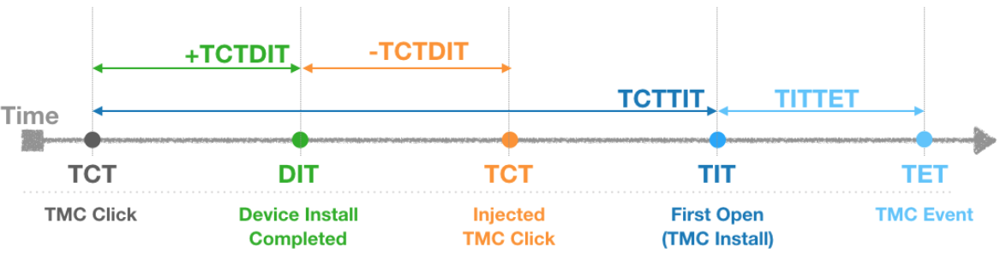

# AA Custom Fraud Analysis Guide

- Author : Bohyung Son
- Email : bson@branch.io
- Last updated: Dec. 28 2018

---
## Table Of Content
* Introduction to Custom Fraud Categories
* Timestamps and Lag-times Used for Analysis

---
## Introduction to Custom Fraud Categories.

#### Normal
* Devices currently regarded as normal device.
* Fraud detection logic is keep being improved, so some normal devices could be categorized as suspicious or fraudulent in the next analysis.

#### Custom Fraud Rule (install only)
* Installs marked as suspicious by AA custom fraud rule which was enabled by advertiser.

#### Country Conflict (install only)
* Installs marked as suspicious by AA country conflict fraud rule which was enabled by advertiser.

#### CI:-100~0 (install only)
* Installs attributed to the publishers by click injection fraud.
* Detection logic is based on the TCTDIT which is computation of time difference between click timestamp and device installation timestamp.
* Positive TCTDIT means click is prior to device installation, and negative value means device installation is prior to click.
* Click injecting fraudsters install malware's on devices in advance, and fire clicks as soon as the malware detects new app installation. By doing so, the injected click take credit for the install as a last click.
   So most of click injected installs, clicks are fired right after device installation.

#### Emul
* Devices recognized as either emulator or abnormal device or fraud tool by various data points.
* May some normal devices could fall into this category, but this volume would be a tiny fraction because current detection logic is conservative.
* For some (mostly MMORPG) games' normal users use emulators for easier game control. Please be aware that some real users emulators could be categorized as 'Emul' along with fraudulent devices.

#### SusDevice
* Devices recognized as suspicious using various data points like brand, model, country, language, and etc.
* It does not mean all the devices in this category are fraud. If small proportion of these devices evenly appear across all the publishers, you can regard it as normal. But noticeably high proportion of devices appear from some publishers or sub-publishers, many of them could be fraudulent devices.
* It is recommended to set baseline as proportions of these devices from internal advertising channel and trusted publishers

#### FP:TCTTIT>1H (Install Only)
* *It is strongly recommended to set fingerprint window of all the publishers to 1 hour*
* Fingerprint installs having greater than 1 hour of click to install lag-time are categorized as this category.
* This is a characteristic grouping of fingerprint installs, and does not mean each install falls into this category is fraudulent.
* For normal publishers, installs fall into this category are usually less than around 5%, and these installs are not fraudulent.
* It is recommended to set baseline as proportions of these devices from internal advertising channel and trusted publishers.
* If small proportion of these devices evenly appear across all the publishers, you can regard it as normal. But noticeably high proportion of devices appears only from some publishers or sub-publishers, many of them could be fraudulent devices.

#### FP:CS Suspicious (Install Only)
* Among fingerprint installs which are suspicious as click spamming.
* This is a characteristic grouping of fingerprint installs, and does not mean each install falls into this category is fraudulent.
* For normal publishers installs fall into this category are usually less than  around 5%, and these installs are not fraudulent.
* It is recommended to set baseline as proportions of these devices from internal advertising channel and trusted publishers.
* If small proportion of these devices evenly appear across all the publishers, you can regard it as normal. But noticeably high proportion of devices appears only from some publishers or sub-publishers, many of them could be fraudulent devices.
* If volume of both "FP:TCTTIT>1H" and "FP:CS Suspicious" are noticeably higher than the other publishers, this is stronger indication of click spamming/flooding.

#### GDT:Null (Install Only)
* Installs install begin timestamp, which is collected from Google Play Install Referrer Library, is not collected.
* This timestamp is supported from Google Play Store v8.3.78 which was released in Oct. 2017. So missing install begin timestamp means Play Store app is not updated more than 1 year, so these devices are most likely not real user's ones.

#### NOTE:
1. For each category, if per publisher or sub-publisher proportions are lower than 5~10% and appear evenly across all the publishers, we could regard it as normal.
   I recommend to to set baseline using proportions of the internal advertising channel and trusted publisher. If noticeably high proportions are detected from some publishers or sub-publishers, most likely many of these devices are fraudulent.
2. Apps in some verticals could show higher proportions on some fraud categories.
 * Ex1) Travel app: Usually higher proportion of country conflict.
 * Ex2) MMORPG games: Some normal gamers use emulator on desktop/laptop for easier game control.

---
## Timestamps and lag-times used for Analysis

#### Timestamps
1. TCT (TMC Click Timestamp) : Timestamp of matched click
    * "Install Log Report" column name: Click/Impression Datetime
    * Reporting API/Install Log field name: session_datetime

2. DIT (Device Install Timestamp) : The time app is installed on the device.
    * "Install Log Report" column name: Install Datetime
    * Reporting API/Install Log field name: install_date

3. TIT (TMC Install Timestamp): The time app is first opened
    * "Install Log Report" column name: Datetime
    * Reporting API/Install Log field name: created

4. TET (TMC Event Timestamp) : The time event is sent.
    * "Event Log Report" column name: Datetime
    * Reporting API/Event Log field name: created

#### Lag-times
1. TCTTIT : Lag-time between TCT and TIT
    * > Formula: TIT - TCT

2. TCTDIT : Lag-time between TCT and DIT
    * > Formula: DIT - TCT

    * For the most of the installs this values are positive, but some installs could have negative values.
   Some normal users could install apps, but do not open the app. If the users first open the app later after ad click, then the lag-time is negative.
    * For the click injected installs, clicks are fired as soon as device installation is detected by malware, so most of the lag-times will be concentrated between -100 and 0. Only a tiny fraction of normal installs could fall into this range.

3. TITTET : Lag-time between TIT and TET.
    * > Formula: TET - TIT

    * This lag-time is used to analyze user's post-install behavioral pattern.
