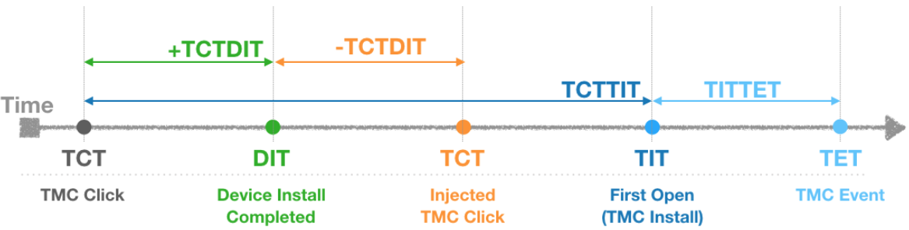

# AA 커스텀 Fraud 분석 가이드

- Author : Bohyung Son, 손보형
- Email : bson@branch.io
- Last updated: Dec. 28 2018

---
## 목차
* 커스텀 광고사기 분류 소개
* 분석에 사용되는 타임스탬프와 래그타임

---
## 커스텀 광고사기 분류 소개

#### Normal
* 현재 정상적인 추정되는 기기
* 광고사기 판단 방법은 계속 향상되고 있으므로, 현재 시점에서 정상으로 판단되는 기기도 이후 분석에서는 의심 기기로 분류될 수 있습니다.

#### Custom Fraud Rule (인스톨에만 적용)
* AA 대쉬보드에서 광고주가 설정한 커스텀 Fraud Rule에 의해서 Suspicious(의심)으로 설정된 기기

#### Country Conflict (인스톨에만 적용)
* AA 대쉬보드에서 광고주가 설정한 Country Conflict(국가불일치) Fraud Rule에 의해서 Suspicious(의심)으로 설정된 기기

#### CI:-100~0 (인스톨에만 적용)
* Click Injection(클릭인젝션)에 의해서 특정 매체로 애트리뷰션된 인스톨
* 클릭시각과 앱이 기기에 설치된 시각차를 계산한 TCTDIT를 사용해서 판단합니다.
* 양수의 TCTDIT 값은 인스톨에 매칭된 클릭이 앱이 기기에 설치된 시각 보다 빠른 경우이고, 음수 값은 인스톨에 매칭된 클릭 앱이 설치된 이후 발생한 경우 입니다.
* 클릭인젝션은 안드로이드 기기에 이미 멀웨어가 설치된 상태에서 해당 멀웨어가 신규 앱의 설치를 인지하게 되면 앱이 실행되기 이전에 신속하게 해당 앱에 대한 클릭을 발생시키는 방법을 통해서 마지막 클릭을 가져가게 방식으로 이루어집니다. 그렇기 때문에 이 경우 클릭은 앱이 설치된 직후에 대부분 발생하게 됩니다.

#### Emul
* 여러 정보들을 종합적으로 판단해서 에뮬레이터, 비정상기기, 또는 광고사기툴을 통해서 생성된 인스톨 또는 이벤트로 판단되는 경우 입니다.
* 소량의 정상기기가 이 분류에 포함될 수도 있지만 보수적으로 판단을 하고 있으므로 이런 경우는 매우 적을 것입니다.
* 일부 게임의 경우 정상적인 사용자들이 게임 조작의 편의을 위해 에뮬레이터를 사용하는 경우도 있으며, 이 경우는 'Emul'로 판단된 기기중 정상 사용자가 많이 포함될 수 있음에 유의 하시기 바랍니다.

#### SusDevice
* 제조사, 모델, 국가, 언어등의 다양한 정보들을 종합적으로 판단해서 의심 기기로 판단한 분류입니다.
* 이 분류에 포함된 각각의 기기들이 꼭 광고사기 의심기기라는 것은 아니며, 모든 매체에 소량이 고르게 분포하고 있다면 정상으로 판단하시면 됩니다. 하지만 일부 매체나 일부 하위매체에서 해당 기기들의 타매체 대비 유의미하게 높은 비중을 보인다면 그중 상당수는 광고사기일 가능성이 높습니다.
* 자체 광고매체나 신뢰할만한 광고매체에서의 해당 분류의 비중을 정상으로 판단한는 기준으로 삼으시고 이를 매체 또는 하위매체별로 적절한 비중인지 확인하시는 것을 권장드립니다.

#### FP:TCTTIT>1H (인스톨에만 적용)
* *모든 매체에 대해서 핑거프린트 애트리뷰션 윈도우를 1시간으로 설정하는 것이 권장됩니다.*
* 이 분류의 인스톨들은 핑거프린트 방식을 통해서 발생한 인스톨중 클릭후 인스톨 발생(최초실행)까지 1시간간 이상이 소요된 인스톨을을 분류한 것입니다.
* 핑거프린트 인스톨의 특성을 이용한 분류이며, 이 분류의 모든 인스톨이 Fraud라는 것은 아닙니다.
* 일반적인 매체에서는 이 분류에 속하는 인스톨이 비중이 대략 5% 이하의 소량의 비중을 가지는 것이 일반적이며 이 경우에는 해당 인스톨들은 정상입니다.
* 자체 광고채널 또는 신뢰성 있는 매체에서의 비중을 정상으로 판단하는 기준으로 삼으시는 것을 권장합니다.
* 해당 분류의 인스톨들이 적은 비중으로 모든 매체에 고르게 분포되어있을 경우는 정상으로 보시면 되며, 타매체 대비 유의미하게 높은 비중을 가지는 매체나 하위매체가 있다면 이중 상당수는 클릭스패밍에 의한 인스톨일 가능성이 높습니다.

#### FP:CS Suspicious (인스톨에만 적용)
* 핑거프린트 방식으로 애트리뷰션된 인스톨중 클릭스패밍에 의한 것으로 의심가는 인스톨들을 분류한것 입니다.
* 핑거프린트 인스톨의 특성을 이용한 분류이며, 이 분류의 모든 인스톨이 Fraud라는 것은 아닙니다.
* 일반적인 매체에서는 이 분류에 속하는 인스톨이 비중이 대략 5% 이하의 소량의 비중을 가지는 것이 일반적이며 이 경우에는 해당 인스톨들은 정상입니다.
* 자체 광고채널 또는 신뢰성 있는 매체에서의 비중을 정상으로 판단하는 기준으로 삼으시는 것을 권장합니다.
* 해당 분류의 인스톨들이 적은 비중으로 모든 매체에 고르게 분포되어 있을 경우는 정상으로 보시면 되며, 타매체 대비 유의미하게 높은 비중을 가지는 매체나 하위매체가 있다면 이중 상당수는 클릭스패밍에 의한 인스톨일 가능성이 높습니다.
* "FP:TCTTIT>1H" 와 "FP:CS Suspicious"의 볼륨이 타매체 대비 유의미하게 높은 비중을 보인다면 클릭스패밍(클릭플러딩)의 가능성이 더욱 높습니다.

#### GDT:Null (인스톨에만 적용)
* 구글 플레이 인스톨 레퍼러 라이브러리를 통해서 수집된 인스톨시작시각 정보가 수집되지 않은 인스톨들 입니다.
* 이 정보는 2017년 10월에 릴리즈된 구글 플레이스토어 앱 버전8.3.73부터 제공이되므로, 이 정보가 없다면 1년이상 플레이스토어 앱이 업데이트 되지 않았음을 의미하며 실제 일반사용자의 기기가 아닐 가능성이 매우 높습니다.

#### NOTE:
1. 각각의 분류에 대해서 매체 또는 하위매체별로 각각의 비중이 5~10% 이하의 소량을 보이고 모든 매체에 고르게 발생하는 경우는 일반적으로 정상으로 볼수 있으며 자체매체 또는 신뢰성있는 매체에서의 비중을 정상범위의 기준으로 삼으시는 것을 권장드립니다. 특정 매체 또는 하위매체에서 유의미하게 높은 비중을 가지는 경우에는 광고사기의 가능성이 높습니다.
2. 특정분야의 앱의 경우에는 특정 분류의 인스톨들이 일반적인 경우보다 높은 비중을 보일 수 있습니다.
    * 예1) 여행관련 앱: 다른 앱들에 비해서 국가 불일치의 비중이 전반적으로 높을 수 있습니다.
    * 예2) MMORPG 게임: 일부 정상유저들은 조작 편의성을 위해서 데스크탑 또는 노트북에서 에뮬레이터를 사용해서 플레이 할 수 있습니다.

---
## 분석에 사용되는 타임스탬프와 래그타임

#### 타임스탬프
1. TCT (TMC Click Timestamp) : 매칭된 클릭이 기록된 시각
    * "Install Log Report" 컬럼이름: Click/Impression Datetime
    * Reporting API/Install Log 필드이름: session_datetime

2. DIT (Device Install Timestamp) : 앱이 기기에 설치된 시각
    * "Install Log Report" 컬럼이름: Install Datetime
    * Reporting API/Install Log 필드이름: install_date

3. TIT (TMC Install Timestamp): 앱이 설치이후 최초 오픈되어 인스톨이 발생한 시각
    * "Install Log Report" 컬럼이름: Datetime
    * Reporting API/Install Log 필드이름: created

4. TET (TMC Event Timestamp) : 이벤트가 기록된 시각
    * "Event Log Report" column name: Datetime
    * Reporting API/Event Log field name: created

#### 래그타임
1. TCTTIT : 클릭후 인스톨발생(최초오픈)까지 걸린 시간
    * > Formula: TIT - TCT

2. TCTDIT : 클릭후 기기에 앱이 설치되기 까지 걸린 시간
    * > Formula: DIT - TCT

    * 대부분의 인스톨의 경우 이 값은 양수입니다만, 일부의 경우 음수가 될 수도 있습니다.
   이전에 앱을 인스톨 했지만 실행은 하지 않고 있다가, 나중에 광고 클릭후 최초실행을 하게 되는 경우 음수가 됩니다.

    * 클릭인젝션에 의한 인스톨인 경우 멀웨어가 앱설치를 인지하자마자 클릭이 발생 시키므로 대부분의 TCTDIT 값은 -100초에서 0초 사이에 집중되게 됩니다.
   일부 소수의 정상인스톨들 일부 이 래그타임 범위에 포함될 수도 있으나 이런 경우는 매우 드물 것입니다.

3. TITTET : 인스톨발생(최초오픈) 이후 이벤트가 기록되기 까지 걸린 시간
    * > Formula: TET - TIT

    * 이 래그타임은, 인스톨 이후 사용자의 행동 패턴을 분석하는데 사용됩니다.
