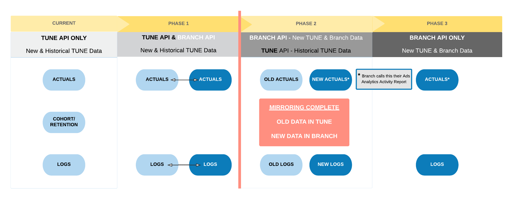

# Export API 마이그레이션 가이드

    Modified on: Sat, Feb 2, 2019 at 10:42 PM
---

## 개요
TUNE에서 Branch로의 쉽게 전환 하실수 있도록 변경사항이 최소화된 Custom Export API가 제공되며 이를 통해 Attribution Analytics의 데이터를 익스포트하실 수 있습니다.

앞으로 진행될 과정/단계와 TUNE Export API(Reporting API)와 Branch Custom Export API사이의 유사성과 차이점을 이해 하실 수 있도록 권장되는 이전 방식에 대해서 아래에 설명드립니다.

## 1단계: 듀얼 API 접근
마이그레이션이 시작되면 브랜치 대쉬보드를 사용하실 수 있습니다. 로그인 이메일을 받으실 때 브랜치 Custom Export API를 통해서 TUNE 데이터를 다운로드받는 방법에 대한 자세한 설명을 함께 제공 받으실 것입니다. 이 새로운 API를 통해서 Branch 시스템으로부터 데이터를 직접 익스포트 하실때 이미 익숙한 기존 TUNE에서 사용되던 필드이름들을 사용하실 수 있습니다.

이 단계에서 브랜치 Custom Export API에 테스트에 관련되어 제공되는 사용방법들을 따르시는 것을 권장드립니다. 브랜치에서 다운받은 데이터를 확인하시고 ETL과정을 통해서 데이터가 잘 처리되는지 검증하셔야 합니다. 그리고 이 API에 관련된 고객사의 시스템이 기대되는대로 정상적으로 동작하는지 확인하시기 바랍니다.

다음 단계에서는 더이상 TUNE에서 직접 데이터를 다운로드 받을 수 없기 때문에 이 단계에서 브랜치 Custom Export API를 통해서 테스트 요청을 보내서 작업들이 제대로 수행되는지 확인을 하시는 것이 매우 중요합니다.

## 2단계: Branch Custom Export API만 지원
브랜치 시스템으로의 마이그레이션이 완료된 다음부터는 신규 데이터는 더이상 TUNE 시스템으로 전달 되지 않습니다. TUNE으로 전송되는 모든 데이터는 브랜치 시스템로 미러링 되며 브랜치에서 모든 데이터를 처리되게 됩니다. 최종 계정 마이그레이션 완료 공지를 받으신 이후부터는 브랜치 Custom Export API를 통해서 익스포트 하셔야 합니다.

브랜치 Custom Export API에 접근하기 위해서는, 단지 '&branch_redirect=3'를 기존의 TUNE 익스포트 API 호출에 추가합니다. 이를 통해서 TUNE이 아닌 Branch시스템으로 쿼리가 전달되게 됩니다.

제한된 기간(최대 2019년 4월 하순까지) 동안은 기존 데이터(신규데이터가 브랜치에서만 처리되는 시점 이전의 데이터)를 익스포트 TUNE으로부터 익스포트 하실수 있습니다. [로그 배치 익스포트](https://developers.tune.com/reporting-docs/batch-exporting-logs/)  문서를 통해서 기존데이터를 익스포트 하실수 있습니다.

이 날짜 이후에는 TUNE의 모든 시스템은 종료되고 접근이 불가합니다.

## 3단계: TUNE Export(Reporting) API 종료
2019년 4월에 모든 TUNE 시스템은 종료되고 모든 기존에 저장돈 데이터들은 영구적으로 삭제될것입니다. 이 시점에 TUNE Export API는 더이상 동작하지 않을 것이며 별도의 데이터 익스포트 요청을 하실수 없게 됩니다.

## 고객사측의 대응이 필요한 사항
Branch Custom Export API접근에 대한 설명이 담인 메일을 받으실 것입니다.
현재의 TUNE Export API의 요청 URL에 단순히 '&branch_redirect' 쿼리 파라메터를 추가 하시면됩니다.

* **1단계**: TUNE과 브랜치의 익스포트 API를 통해서 데이터를 익스포트 하신후 양측의 데이터를 비교하셔야 합니다. Branch Custom Export API 데이터를 사용해서 익스포트 된 데이터가 현재의 ETL작업에 문제없이 처리가 되는지 확인하셔야합니다.
* **2단계**: 현재의 데이터를 익스포트시 Branch Custom Export API를 사용하셔야 합니다. Branch Custom Export API사용방법은 조만간 메일로 전달될 것입니다.
* **3단계**: 모든 API요청에 타임존을 꼭 명시하시기 바랍니다. 아래에 설명된 것처럼 3단계부터는 타임존이 명시되지 않으면 UTC가 적용됩니다.

## 작은 차이점들
### 타임존이 지정되지 않았을 경우 차이점
Export API 요청에서 타임존이 지정되지 않을 경우 TUNE에서는 디폴트로 해당 사용자의 타임존이 적용되었습니다.
2019년 4월 TUNE 시스팀에 동작되고 있는 시점 까지는 이경우 Branch Custom Export API는 해당 사용자의 타임존을 사용할 것입니다.

하지만 2019년 4월 TUNE 시스팀에 종료된 이후에는 UTC가 디폴트 타임존으로 사용됩니다. 그러므로 모든 Export API 요청시 명시적으로 timezone 쿼리파라메터에 타임존을 지정하는 것을 매우 권장됩니다.

### 지원이 중단되는 로그들
현재 이벤트 아이템의 익스포트는 2019년 1월 현재 지원되고 있지 않습니다. 3월또는 4월중 가까운 시일내에 지원될 예정입니다. 현재 이벤트 아이템을 익스포트 하고 계시다면 관련사항에 대한 논의를 위해 연락 주시기 바랍니다.

거의 사용되지 않던 아래의 로그는 더이상 지원되지 않습니다.

* updates
* postbacks

위 두 로그를 API 통해서 익스포트 하고 계신다면, CSM팀 또는 서포트팀을 통해 연락을 주시면 가능한 방법에 대해서 논의를 할수 있습니다.

### 지원이 중단되는 필드들
거의 활용되지 않던 몇몇 필드들은 지원이 중단됩니다.
해당 필드들이 꼭 필요한 사용예가 있으시다면 해당 정보를 CSM 또는 서포트팀으로 알려주시면 해당 필드들이 지원될 수 있을지 함께 논의해 보겠습니다.

### SQL 필터링
오래된 filter쿼리 파라메터는 더이상 지원되지 않을 것입니다.
filter 쿼리파라메터를 사용하는 모든 API요청들은 filter_cthulhu를 사용해서 재작성 해주시기 바랍니다.
필터 재작성에 대한 문의사항은 CSM 또는 서포트팀으로 문의 주시기 바랍니다.
