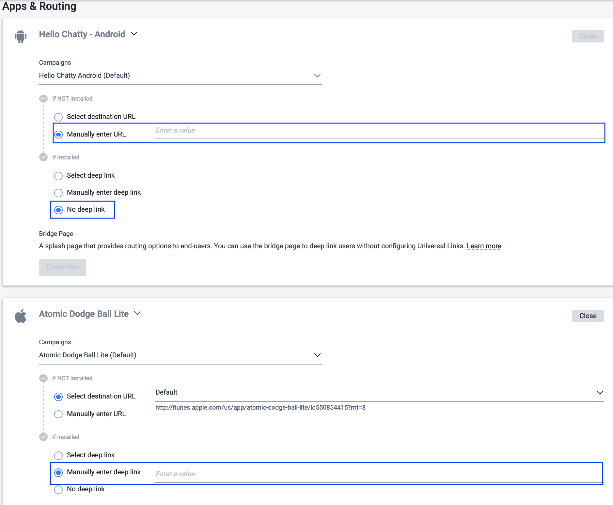

# TUNE Link Deferred Deep Linking 가이드 (안드로이드)

    Modified on: Mar 8, 2019
---

## 개요
**마이그레이션 이후 TUNE Link를 사용해서 안드로이드앱에서 구글플레이 또는 브릿지 페이지로 사용자를 랜딩 시키는 경우** 구글에서 지원하는 디퍼드 딥링킹 기능을 이용해서 디퍼드 딥링킹과 일반 딥링킹을 함께 지원할수 있도록 하는 방법을 설명드립니다.

애플의 경우 앱스토어에서 유사한 기능을 제공하지 않기 때문에 iOS앱에서 디퍼드 딥링킹을 하기 위해서는 Attribution Analytics의 디퍼드 딥링킹 기능을 사용하셔야 함을 알려드립니다. 아래의 문서를 함께 참고 하시기 바랍니다.

* [Deferred Deep Linking with Attribution Analytics](https://help.tune.com/marketing-console/deferred-deeplinking-with-attribution-analytics/)
* [Implementing a Deferred Deep Link (SDK연동방법)](https://developers.tune.com/sdk/implementing-a-deferred-deep-link/#code-platform-ios)


## 구글 플레이스토어 랜딩시 디퍼드 딥링킹과 일반 딥링킹 동시 지원

### 개요
* TUNE Link 클릭시 미설치의 경우 바로 플레이스토어로 랜딩시키는 경우 구글에서 제공하는 `url`파라메터를 사용해서 일반 딥링킹과 디퍼드 딥링킹을 동시에 지원할 수 있습니다.
* TUNE Link에 `Destination URL`만 설정하고 `Deep Link URL`은 설정하지 않습니다.
* 마이그레이션 이후에는 인스톨 애트리뷰션은 정상적이나 {tracking_id}매크로에 대한 미지원으로 이벤트 애트리뷰션 과 리인게이지먼트 측정은 지원되지 않을 수 있습니다. (추후 업데이트)

### TUNE Link용 Destination URL 생성페이지
* 아래의 페이지에서 딥링크를 입력하면 URL인코딩된것과 URL인코딩이 안된 구글 플레이스토어 URL 두개가 생성되며 **[URL인코딩](urlencode.html) 된것을 TUNE Link에 설정**합니다.
    * [Destination URL 생성페이지](gen-dest-url-for-ddl.html)
    * TUNE Link 생성페이지에서는
        * "If NOT install" : "Manually enter URL"에 생성된 붙여넣으시면 되며,
        * "If installed" :  "No deep link"를 선택합니다.
    
    * TUNE Link에 직접 설정하시는 경우에는 `destination_id_android`는 삭제하고, `url_android`에 생성된 것을 설정합니다.
        * 안드로이드앱 전용 TUNE Link의 경우에는 `url`에 설정할수도 있습니다.
    * **iOS앱의 경우**
        * iOS에서는 5분 이내에 중복 클릭시 TUNE에서 자체 생성한 브릿지 페이지가 보일 수 있으며, 앱이 미설치된 경우 앱을 찾을수 없다는 팝업이 발생하게 됩니다.
        * TUNE Link페이지 에서 작업시: "If install"에서 `url_ios`에 원하는 딥링크를 단순 URL 인코딩한후 설정하시면됩니다.
        * TUNE Link 직접 수정시: `destination_id_ios`가 있다면 삭제하시고 `url_ios`에 딥링크를 단순 URL 인코딩한후 설정하시면됩니다.

* 마이그레이션이후에는 기존에 TUNE 대쉬보드에 저장해놓은 Destination URL은 `destination_id` 파라메터로 설정 가능 하지만, 신규 Destination URL은 저장하실 수 없으므로 , 그 대신 여기에 설명된 것과 같이 실제 URL을 직접 설정하는 `url` 또는 `url_android`를 사용합니다.
* 마이그레이션에 관련된 일부 변경사항에 대해서는 [TUNE Link 가이드](tune-link-post-migration.md)를 참고하세요.


## 브릿지페이지 사용시 일반 딥링킹 및 디퍼드 딥링킹 지원

### 개요

* [테스트및 구현 샘플페이지](./bridge/index.html)

* 샘플페이지내의 TUNE Link 및 구현 설명
```

https://s9u-6.tlnk.io/serve?
          action=click&
          publisher_id=174354&
          site_id_android=2385&site_id_ios=2962&
          campaign_id_android=236537&
          campaign_id_ios=237906&
          url_android=https%3A%2F%2Fbson-branch.github.io%2Fdocs%2Fguides%2Fmigration%2Fbridge%2Fbridge.html&
          url_ios=https%3A%2F%2Fbson-branch.github.io%2Fdocs%2Fguides%2Fmigration%2Fbridge%2Fbridge.html

```
    * 위의 샘플링크는 안드로이드와 iOS모두 https://bson-branch.github.io/docs/guides/migration/bridge/bridge.html 페이지로 랜딩시키도록 되어있습니다.
    * 랜딩페이지의 URL은 **[URL인코딩](urlencode.html)**을 한 다음 설정하는 것이 권장됩니다.
    * 랜딩페이지는 **HTTPS**여야 앱의 웹뷰 내에서 클릭후 랜딩시에도 이상없이 랜딩될 수 있습니다.
    * 안드로이드앱에서 구글플레이로 랜딩시만 해당 작업이 필요하며 iOS에서 앱스토어로 랜딩시킬 때는 특별한 작업이 필요 없습니다.

### 구현사항 상세설명
샘플페이지내의 JavaScript 소스코드에도 설명되어있는 사항을 다시한번 요약정리 하면 아래와 같습니다.

1. TUNE Link클릭시 브릿지페이지 랜딩시 쿼리파라메터에 `referrer`가 추가되되며,
    `mat_click_id%3D3e4c2abeef0d74958ae4bff96be434b6-20190301-877`과 같은 형식입니다 이를 한번 URL디코딩하면  `mat_click_id=3e4c2abeef0d74958ae4bff96be434b6-20190301-877`와 같이 `=`를 구분자로 하는 `키=값` 형식이 됩니다.
      * 키 mat_click_id의 값에는 클릭시마다 매번 고유한 클릭아이디 값이 생성됩니다.
      * 추가 리다이렉트가 발생하는 경우 `referrer`를 계속 다음페이지로 전달하면서 값을 전달해줘야 최총 마켓 랜딩시 이를 전달할 수 있습니다.

2. `referrer`를 인코딩해서 키 `mat_click_id`에 설정된 값을 얻습니다.

3. **딥링크URL**: `referrer`를 URL디코딩해서 키 `mat_click_id`와 값의 쌍을 쿼리파라메터에 추가해서 실제 사용할 최종 딥링크URL을 생성합니다.
    단, 이미 쿼리파라메터가 있다면 `&`를 추가한 뒤에 설정하고, 없다면 `?`를 추가한 뒤에 설정합니다.
    * 예1:
      ```
      hellochatty://hellochatty.co/chat
      hellochatty://hellochatty.co/chat?mat_click_id=2e7ea400184b74689770fc371b538254-20190301-877
      ```
    * 예2:
      ```
      hellochatty://hellochatty.co/chat?friend_name=test
      hellochatty://hellochatty.co/chat?friend_name=test&mat_click_id=2e7ea400184b74689770fc371b538254-20190301-877
      ```


4. **마켓URL의 referrer파라메터**: 구글 플레이 랜딩 URL에 브릿지페이지 랜딩시 전달 받은 `referrer`를 그대로 추가합니다.
    * 원본 구글 플레이 URL:
      ```
      https://play.google.com/store/apps/details?id=com.hellochatty
      ```
    * 인스톨 애트리뷰션을 위한 구글 플레이 URL :
      ```
      https://play.google.com/store/apps/details?id=com.hellochatty&referrer=mat_click_id%3D2e7ea400184b74689770fc371b538254-20190301-877
      ```
5. **마켓URL의 url파라메터**: 그다음 3단계에서 만든 딥링크URL을 한번 URL인코딩한 후 `url`파라메터에 설정합니다.
    * 인스톨 애트리뷰션 및 디퍼드 딥링킹을 위해 구글 클레이 URL :
      ```
      https://play.google.com/store/apps/details?id=com.hellochatty&
          referrer=mat_click_id%3D2e7ea400184b74689770fc371b538254-20190301-877&
          url=hellochatty%3A%2F%2Fhellochatty.co%2Fchat%3Fmat_click_id%3D2e7ea400184b74689770fc371b538254-20190301-877
      ```
